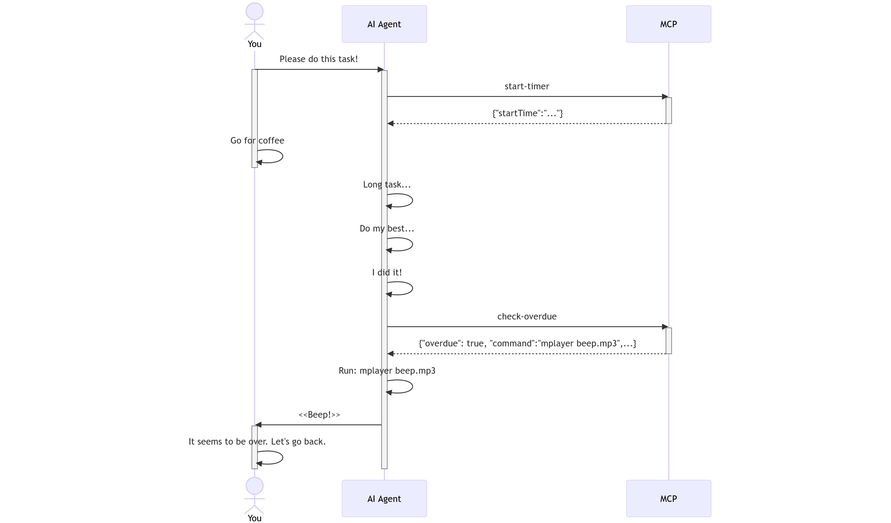

# notify-completion-mcp-server


The MCP server that provides notifications when AI agents complete long-running tasks. This allows you to leave your desktop without forgetting about tasks.

## How It Works



The notify-completion-mcp-server addresses the issue of users needing to actively monitor their computer for AI task completion. By providing a notification mechanism triggered when tasks are finished, users can multitask more efficiently without repeatedly checking task status.

## Installation

1. Add server config to Cline (`cline_mcp_settings.json`):

```json
{
  "mcpServers": {
    "notify-completion": {
      "command": "npx",
      "args": ["-y", "@nakat-t/notify-completion-mcp-server@latest"],
      "env": {
        "OVERDUE_COMMAND": "<Command to execute very flashy effects>",
      },
      "autoApprove": [ "start-timer", "check-overdue" ]
    }
  }
}
```

2. Change the config environment variables to your value.
    * `OVERDUE_COMMAND`: Write a command to notify you when the task is complete.

3. Check Cline's Auto-approve `Execute safe commands` and `Use MCP servers`. These must be auto-approve because Cline will execute the command and notify you when you are away.

4. Copy the following custom instructions and paste to your Cline's settings.

## Custom Instructions for Cline

```markdown
# You MUST use the `notify-completion` MCP: Task Completion Notification Guide

**⚠️ CRITICAL INSTRUCTIONS - YOU MUST FOLLOW THESE GUIDELINES ⚠️**

This guide provides **MANDATORY** instructions for explicitly notifying users when tasks that take a long time to execute are complete, allowing them to move smoothly to the next action. Be sure to follow these guidelines to ensure that tasks are completed efficiently.

## ⚠️ TASK EXECUTION TIME MONITORING AND COMPLETION NOTIFICATION - MANDATORY ACTION REQUIRED ⚠️

**IMPORTANT**: At the start of the task, you MUST:

1. **MUST** Run the 'start-timer' tool of the 'notify-completion' MCP.

**IMPORTANT**: When executing a task and reaching the stage where ask_followup_question or attempt_completion is executed, you MUST:

1. **MUST** Run the 'check-overdue' tool in 'notify-completion' MCP.
2. **MUST** If the 'check-overdue' tool reports 'overdue': true, execute the contents of 'command' using execute_command.

Remember to monitor the task execution time. Be sure to use the 'notify-completion' MCP. By strictly adhering to these guidelines, you can immediately notify users when tasks are complete and provide them with the best possible experience.
```

## For use it other than Cline

This MCP server was created for use with Cline. However, if the AI agents you are using can execute shell commands, it should work as expected with just a few customizations.

Here are some tips for customization:

- The MCP server and json settings do **not** need to be changed.
- The current custom instructions contain wording specific to Cline, so that needs to be changed.
  - Change 1
    ```markdown
    **IMPORTANT**: When executing a task and reaching the stage where ask_followup_question or attempt_completion is executed, you MUST:
    ```
    `ask_followup_question` and `attempt_completion` are terms specific to Cline. Please replace this text with an expression that means "task completion" for the AI agent you are using.
  - Change 2
    ```markdown
    2. **MUST** If the 'check-overdue' tool reports 'overdue': true, execute the contents of 'command' using execute_command.
    ```
    `execute_command` is terms specific to Cline. Please replace this text with an expression that means "execute command" for the AI agent you are using.

## Confing Environment Variables

- `THRESHOLD`: If the task execution time is less than the specified number of seconds, the overdue command is not executed. Default is 0. (always executed)

- `OVERDUE_COMMAND`: Specify the command to execute when the task is completed.

- `EXECUTE_IN_SERVER`: If this variable is defined, the overdue command is executed within the MCP server instead of being executed by the AI agent.

## MCP Tools

1. `start-timer`: Start a timer to measure task execution time.
    * Output: `{"startTime": "<Current time in ISO format>"}`
    * Description: We instruct AI agents to call this tool first before executing tasks. Use custom instruction to do this.
2. `check-overdue`: Check if the task is overdue based on the given threshold.
    * Required inputs:
        * `startTime`: Start time returned by start-timer
    * Output:
        * If the task execution time is not overdue: `{"elapsed": "<seconds>", "units": "seconds", "overdue": false}`
        * If the task execution time is overdue: `{"elapsed": "<seconds>", "units": "seconds", "overdue": true, "command": "${OVERDUE_COMMAND}"}`

## License

[MIT](https://choosealicense.com/licenses/mit/)
