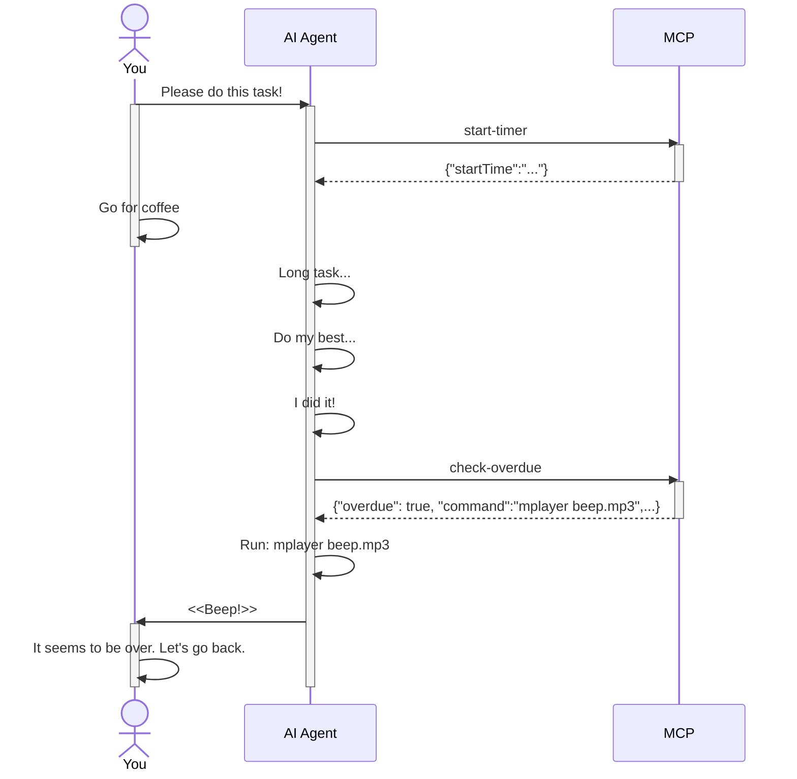

```mermaid
sequenceDiagram
    actor You
    participant AI Agent
    participant MCP
    You ->> AI Agent: Please do this task!
    activate You
    activate AI Agent
    AI Agent ->> MCP: start-timer
    activate MCP
    MCP -->> AI Agent: {"startTime":"..."}
    deactivate MCP
    You ->> You: Go for coffee
    deactivate You
    AI Agent ->> AI Agent: Long task...
    AI Agent ->> AI Agent: Do my best...
    AI Agent ->> AI Agent: I did it!
    AI Agent ->> MCP: check-overdue
    activate MCP
    MCP -->> AI Agent: {"overdue": true, "command":"mplayer beep.mp3",...}
    deactivate MCP
    AI Agent ->> AI Agent: Run: mplayer beep.mp3
    AI Agent ->> You: <<Beep!>>
    activate You
    You ->> You: It seems to be over. Let's go back.
    deactivate You
    deactivate AI Agent
```
